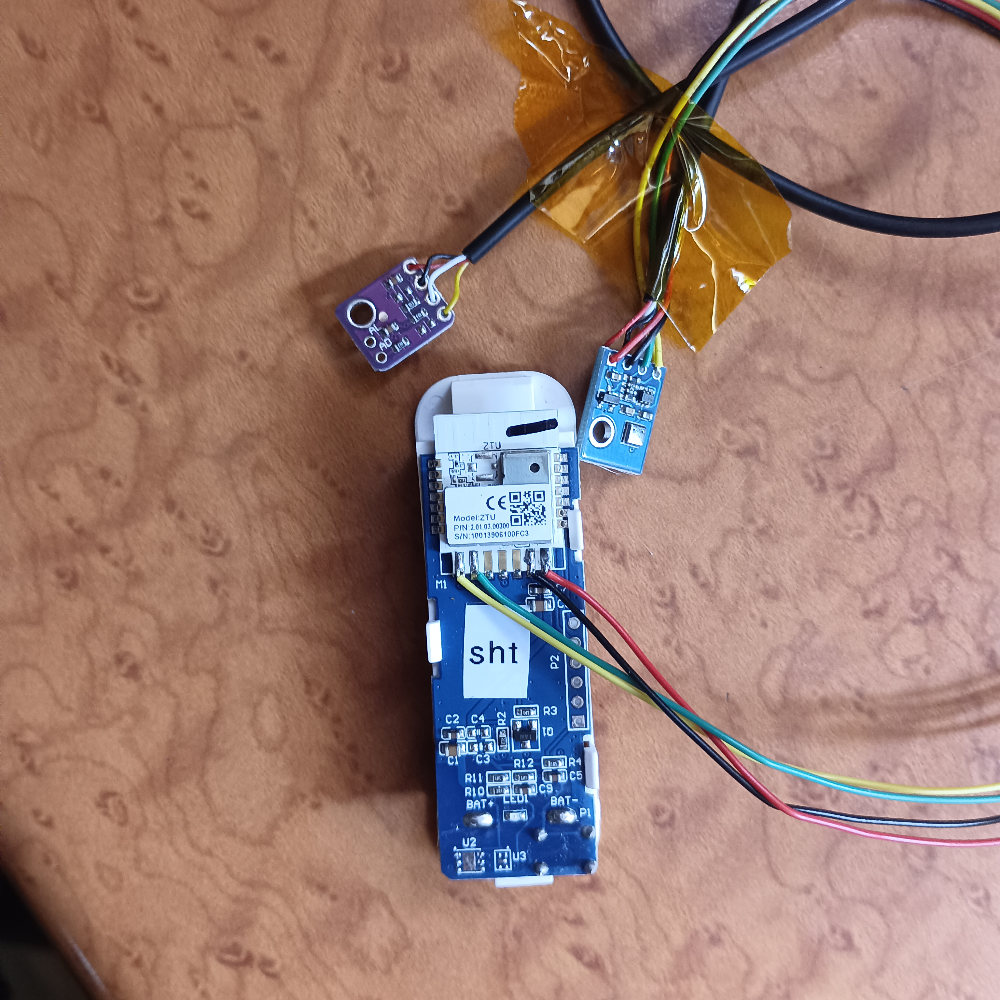

# Custom firmware for Zigbee 3.0 IoT devices on the TLSR825x chip ; purpose of the fork is to create dual temperature sensors from one Zigbee device sensor

Based on an example from  [Telink's Zigbee SDK](http://wiki.telink-semi.cn/wiki/chip-series/TLSR825x-Series/).

Currently supported devices: [TS0201_TZ3000](https://pvvx.github.io/TS0201_TZ3000)

#creation of the sensor 

for the time being  the configuraton supports 2 temperature sensors: one sht30 and one aht2x_3x . this is because small pcb for thoses sensors can be purchased easily
* https://www.aliexpress.com/item/32700729302.html
* https://www.aliexpress.com/item/1005001689846884.html

  

The 2 breakout boards are connected serially

The 2 sensors have different i2c addresses and can be wired in serial
there are curently 2 branches in this repository:
* overload_humi : in this branch  the temperature data from the aht sensor are sent back in place of the original sensor humidity data; not very clean with regard to conformity to Zigbee standard
* dual_endpoints: in this branch only the temperature from the 2 sensors are sent back usng 2 different endpoints using the ZCL_CLUSTER_MS_TEMPERATURE_MEASUREMENT. in this implementation The first endpoint is more complex and includes clusters that provide essential device management and additional functionalities such as  power configuration, and identification. It also handles more complex features like security (IAS Zone).

The second endpoint is streamlined and focuses solely on temperature measurement, making it simpler and more specific to that functionality.

## To flash the Zigbee firmware, use TLSRPGM 

---
